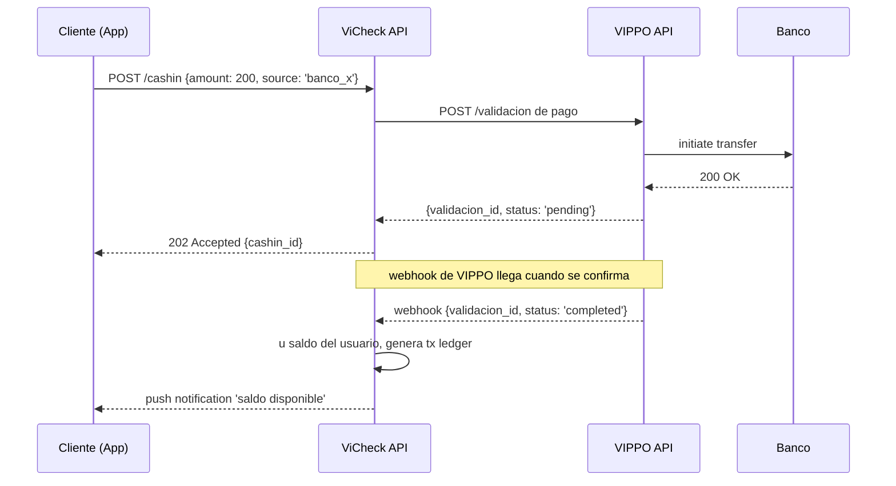
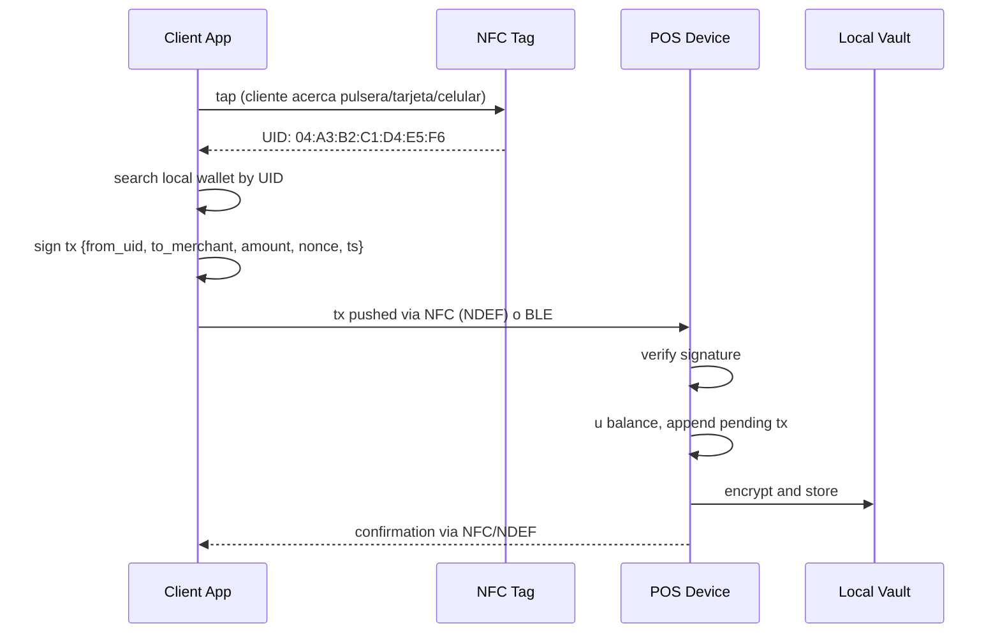
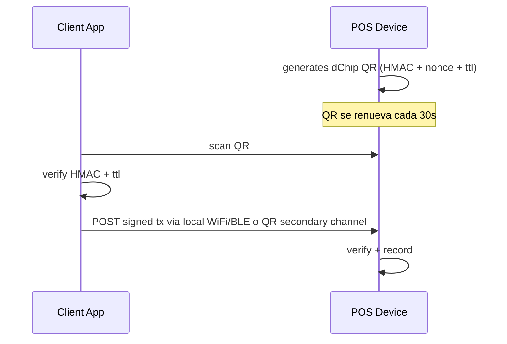
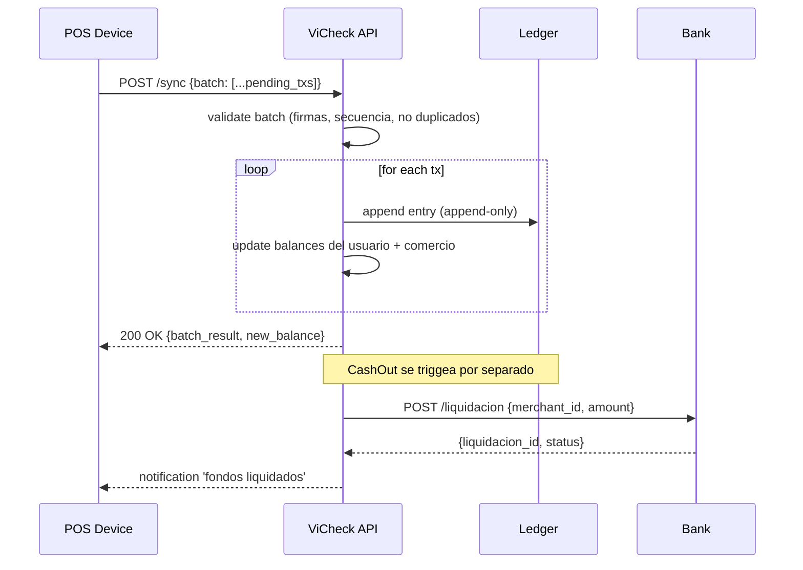

# ViCheck MVP — Arquitectura Técnica

## 1. Visión general

ViCheck es una **billetera offline-first** con un **Motor de Sincronización Asíncrono (OffVi)** que desacopla el ciclo de pago en tres fases independientes. El sistema no asume conectividad; cada componente está diseñado para sobrevivir apagones, zonas sin señal y cortes de WiFi.

```
┌─────────────────────────────────────────────────────────────────────────────┐
│                            CLIENTE (App Android)                            │
│                                                                             │
│  ┌──────────────────┐    ┌────────────────────────────────────┐            │
│  │  NFC Module (NFC) │    │          Core App (Kotlin)         │            │
│  │  - Read UID       │    │  - CashIn UI                       │            │
│  │  - Foreground    │    │  - Payment UI                      │            │
│  │    Dispatch        │    │  - QR Generator (dChip)            │            │
│  └────────┬───────────┘    │  - State machine (online/offline)  │            │
│           │                └─────────────────┬───────────────────┘            │
│           │                                  │                              │
│  ┌────────▼──────────────────────────────────▼───────────────────┐         │
│  │                   Offline-First Engine (Sec 3)                   │       │
│  │  ┌─────────────┐  ┌─────────────┐  ┌─────────────────────────┐│       │
│  │  │ Local Ledger │  │ Tx Queue    │  │ Encrypted Vault (AES-256) ││       │
│  │  │ (balances)   │  │ (pending)   │  │ - pending_transactions   ││       │
│  │  └─────────────┘  └─────────────┘  │ - keys, signatures       ││       │
│  │                                      └─────────────────────────┘│       │
│  └─────────────────────────────────────────────────────────────────┘       │
│                                                                             │
└──────────────────────────────────┬───────────────────────────────────────────┘
                                   │ P2P / NFC tap / QR scan
┌──────────────────────────────────▼──────────────────────────────────────────┐
│                          POS COMERCIO (App Android)                         │
│                                                                             │
│  ┌─────────────────────────────────────────────────────────────────┐        │
│  │                    POS Logic (Kotlin x Compose)                  │        │
│  │  - read NFC UID from client                                      │        │
│  │  - decode dChip QR from client                                   │        │
│  │  - sign transaction (ECDSA P-256)                              │        │
│  │  - update local vault                                            │        │
│  └─────────────────────────────────────────────────────────────────┘        │
│                                                                             │
└──────────────────────────────────┬───────────────────────────────────────────┘
                                   │ Internet when online
┌──────────────────────────────────▼───────────────────────────────────────────┐
│                          BACKEND ViCheck (AWS SAM)                            │
│                                                                              │
│  ┌────────────────────┐  ┌────────────────────┐  ┌────────────────────┐  │
│  │  API Gateway        │  │  Lambda Functions  │  │  EventBridge API     │  │
│  │  (REST + WS)        │  │  (Python 3.14)    │  │  (async events)     │  │
│  └─────────┬────────────┘  └─────────┬──────────┘  └─────────┬──────────┘  │
│            │                          │                       │                      │
│  ┌─────────▼──────────────────────────▼───────────────────────▼──────────┐│
│  │                          Core Services                                  ││
│  │  - CashInService         - LedgerService         - SyncService          ││
│  │  - CashOutService       - TenantService         - BankIntegration       ││
│  └─────────┬──────────────────────────────────────────────┬──────────────┘│
│            │                              │                              │        │
│  ┌─────────▼───────────────┐  ┌────────▼────────────────┐                │
│  │  PostgreSQL (RDS)        │  │  Redis (cache balances) │                │
│  │  - tenants               │  │  - hot balance mirror   │                │
│  │  - users                 │  │  - rate limit current    │                │
│  │  - wallets               │  │  - session cache current  │                │
│  │  - transactions          │  └──────────────────────────┘                │
│  │  - ledger (append-only)  │                                                  │
│  └──────────────────────────┘                                                  │
│                                                                              │
│  ┌─────────────────────────────────────────────────────────────────┐        │
│  │              External: VIPPO APIs                               │        │
│  │  - /validacion de pago (CashIn flow existente)                 │        │
│  │  - /cuentas (gestión bancaria de clientes)                     │        │
│  │  - /liquidacion (entrega a cuenta del comercio)                │        │
│  └─────────────────────────────────────────────────────────────────┘        │
│                                                                              │
└──────────────────────────────────────────────────────────────────────────────┘
```

## 2. Las 3 fases del OffVi Sync Engine

### Fase 1: CashIn (Online)

El usuario final (cliente) o comercio (prestador) carga saldo en su billetera ViCheck. Esta fase **requiere internet** y consume las APIs existentes de VIPPO (`/validacion de pago` y `/cuentas`).



**Eventualidades:**
- Si el webhook no llega en 30s, el cliente puede pull con `GET /cashin/:id`
- Si falla la carga, reversión completa (transactional)
- Auditoría: cada carga queda registrada en `ledger` con `source = 'vippo_cashin'`

### Fase 2: Transacción offline (Void)

El cliente paga al comercio sin internet. Hay dos medios físicos:

#### 2a. NFC (chip-to-phone)



#### 2b. dChip QR (phone-to-phone)



**El PIN de confirmación:** Cada transacción offline con monto significativo (≥ configurable por tenant) requiere **PIN entry en el celular del cliente** antes de firmar.

**Estado local:**
- `Local Ledger (SQLite + SQLCipher)`: balance mirrorado por tenant
- `Pending Transactions Queue`: cola de TX firmadas esperando sync
- `Key Store`: llaves ECDSA del dispositivo

### Fase 3: CashOut + Conciliación (Online)

Cuando el POS comercio detecta internet (NetworkCallback en Android), ejecuta el sync.



## 3. Componentes detallados

### 3.1 Offline-First Engine (Android)

```kotlin
// Estructura de packages
com.vippo.vicheck/
├── core/
│   ├── nfc/                  ← lectura/escritura NFC
│   ├── qr/                   ← generador dChip + scanner
│   ├── crypto/               ← ECDSA, ECDH, AES-256
│   ├── storage/              ← Room + SQLCipher
│   └── sync/                 ← NetworkCallback, retry, backoff
├── data/
│   ├── model/                ← Wallet, Transaction, User, Tenant
│   └── repository/           ← Local + Remote data sources
├── domain/
│   ├── usecase/              ← CashIn, Pay, Sync, CashOut
│   └── state/                ← State machine Online/Offline/Partial
├── feature/
│   ├── onboarding/
│   ├── wallet/                ← balance, history
│   ├── pay/                  ← pagar a comercio
│   ├── topup/                ← cashin flow
│   └── settings/
└── di/                       ← Hilt modules
```

### 3.2 Backend (AWS SAM + Lambda Python 3.14)

```
vicheck-api/
├── template.yaml             ← SAM template
├── src/
│   ├── handlers/
│   │   ├── cashin.py         ← POST /cashin
│   │   ├── sync.py           ← POST /sync
│   │   ├── cashout.py        ← POST /cashout
│   │   ├── balance.py        ← GET /balance/:uid
│   │   ├── webhook_vippo.py  ← inbound webhook
│   │   └── reconciliation.py ← CRON
│   ├── services/
│   │   ├── ledger.py         ← append-only writes
│   │   ├── tenant.py
│   │   ├── vippo_client.py   ← HTTP client a VIPPO APIs
│   │   └── bank_client.py
│   ├── models/
│   │   └── pydantic_models.py
│   ├── db/
│   │   ├── migrations/       ← Alembic
│   │   └── connection.py     ← psycopg2 pool
│   └── utils/
│       └── auth.py            ← JWT validation
├── tests/
│   └── unit/
└── requirements.txt
```

### 3.3 Base de datos (PostgreSQL)

```sql
-- Multitenancy por tenant_id en cada tabla
CREATE TABLE tenants (
  id UUID PRIMARY KEY,
  name TEXT NOT NULL,
  vippo_merchant_id TEXT UNIQUE,
  bank_account_id TEXT,
  status TEXT DEFAULT 'active',
  created_at TIMESTAMPTZ DEFAULT NOW()
);

CREATE TABLE users (
  id UUID PRIMARY KEY,
  tenant_id UUID NOT NULL REFERENCES tenants(id),
  phone TEXT UNIQUE NOT NULL,
  email TEXT,
  full_name TEXT,
  kyc_status TEXT DEFAULT 'pending',
  vippo_user_id TEXT UNIQUE,
  created_at TIMESTAMPTZ DEFAULT NOW()
);

CREATE TABLE wallets (
  id UUID PRIMARY KEY,
  user_id UUID NOT NULL REFERENCES users(id),
  tenant_id UUID NOT NULL REFERENCES tenants(id),
  balance DECIMAL(18,4) NOT NULL DEFAULT 0,
  currency TEXT NOT NULL DEFAULT 'VES',
  status TEXT DEFAULT 'active',
  created_at TIMESTAMPTZ DEFAULT NOW(),
  UNIQUE(user_id, tenant_id, currency)
);

CREATE TABLE transactions (
  id UUID PRIMARY KEY,
  wallet_id UUID NOT NULL REFERENCES wallets(id),
  tenant_id UUID NOT NULL REFERENCES tenants(id),
  type TEXT NOT NULL,        -- 'cashin', 'pay', 'cashout', 'fee'
  amount DECIMAL(18,4) NOT NULL,
  currency TEXT NOT NULL,
  counterparty_id UUID REFERENCES wallets(id),
  status TEXT NOT NULL,       -- 'pending_sync', 'synced', 'reconciled', 'reversed'
  offline_signature TEXT,     -- ECDSA signature hex
  offline_nonce TEXT,
  created_at TIMESTAMPTZ NOT NULL,
  synced_at TIMESTAMPTZ,
  vippo_cashin_id TEXT,
  vippo_cashout_id TEXT
);

CREATE TABLE ledger (
  id BIGSERIAL PRIMARY KEY,
  tx_id UUID NOT NULL REFERENCES transactions(id),
  tenant_id UUID NOT NULL,
  wallet_id UUID NOT NULL,
  direction TEXT NOT NULL,    -- 'debit' o 'credit'
  amount DECIMAL(18,4) NOT NULL,
  balance_after DECIMAL(18,4) NOT NULL,
  recorded_at TIMESTAMPTZ DEFAULT NOW()
);

CREATE INDEX idx_tx_wallet_pending ON transactions(wallet_id, status) WHERE status = 'pending_sync';
CREATE INDEX idx_tx_tenant_created ON transactions(tenant_id, created_at DESC);
```

**Modelo append-only:** `ledger` nunca se modifica. Cualquier corrección genera `tx_terminal_type = 'reversal'`.

### 3.4 Criptografía

| Uso | Algoritmo | Implementación |
|---|---|---|
| Firma tx offline | ECDSA P-256 | Bouncy Castle (Android) / python-ecdsa (backend) |
| Encriptación vault local | AES-256-GCM | Tink (Android) / cryptography (Python) |
| Hash dChip | HMAC-SHA256 | libsodium / Tink |
| Llave dispositivo↔backend | ECDH P-256 | Curva25519 / secp256r1 |
| Storage password | Argon2id | argon2-cffi (Python) |

**Generación de llaves:** El backend genera el par de llaves ECDSA en el registro del dispositivo. La llave privada se entrega al dispositivo sobre un canal seguro (autenticación mutua con TLS) y se almacena en `EncryptedSharedPreferences` de Android.

## 4. Flujo de datos completo (pago offline + sync)

```
CLIENTE                                        COMERCIO                              BACKEND
   │                                              │                                    │
   │ 1. Tap pulsera al POS                        │  │                                    │
   │────────────────────────────────────────────►│  │                                    │
   │                                              │  │                                    │
   │   2. POS lee UID                             │  │                                    │
   │   3. POS consulta balance del UID           │  │                                    │
   │      (lookup local + cache)                 │  │                                    │
   │                                              │  │                                    │
   │   4. POS muestra monto + comercio            │  │                                    │
   │◄─────────────────────────────────────────────│  │                                    │
   │                                              │                                    │
   │   5. Cliente ingresa PIN                     │  │                                    │
   │   6. Cliente firma tx (con llave priv)      │  │                                    │
   │────────────────────────────────────────────►│  │                                    │
   │                                              │                                    │
   │   7. POS verifica firma                      │  │                                    │
   │   8. POS descuenta local                    │  │                                    │
   │   9. POS almacena en vault local            │  │                                    │
   │                                              │                                    │
   │   10. POS muestra OK al comercio + cliente   │  │                                    │
   │◄─────────────────────────────────────────────│  │                                    │
   │                                              │                                    │
   │                                       [NO INTERNET]    [INTERNET VUELVE]           │
   │                                              │                                    │
   │                                              │  11. POST /sync {batch: [...tx]}   │
   │                                              │────────────────────────────────► │
   │                                              │                                    │
   │                                              │  12. Backend valida batch          │
   │                                              │  13. Backend append-only           │
   │                                              │  14. Backend update balance         │
   │                                              │                                    │
   │                                              │  15. 200 OK {new_balance}           │
   │                                              │◄──────────────────────────────── │
   │                                              │                                    │
   │                                              │  16. (opcional) CashOut si         │
   │                                              │     balance > threshold            │
```

## 5. Seguridad

| Capa | Medida |
|---|---|
| **Transporte** | TLS 1.3 en todas las llamadas HTTP/HTTPS |
| **Autenticación** | JWT firmado por backend, refresh tokens con rotación |
| **Autorización** | RBAC por tenant: cliente solo ve su balance, comercio ve sus ventas |
| **Vault local** | AES-256-GCM, llave derivada de master + device-bound key |
| **Firmas tx** | Cada tx tiene nonce + firma ECDSA, previene duplicación |
| **Anti-replay** | Nonce + timestamp en cada tx, ventana de aceptación configurable |
| **Device binding** | Cada dispositivo tiene par de llaves único registrado en backend |
| **Audit log** | Ledger append-only, todas las operaciones registradas |
| **Rate limiting** | Por usuario, por tenant, configurable |
| **Multi-tenancy** | `tenant_id` en todas las queries, nunca cruzado |

## 6. Performance y capacidad esperada

| Métrica | Target MVP | Diseño |
|---|---|---|
| Latencia NFC tap → confirmación | < 300 ms | NFC read + local lookup + firma |
| Sync time (1000 tx pendientes) | < 30 s | Batch upload + idempotente design |
| TPS por nodo POS | ≥ 5 TPS | SQLite local, batch writes |
| Backend TPS | ≥ 100 TPS | Lambda + Postgres + connection cache |
| Cold start Android app | < 2 s | Compose + Hilt + lazy init |
| Tamaño APK | < 50 MB | Sin recursos pesados |

## 7. Despliegue

### 7.1 Android
- Google Play Internal Testing track (closed beta)
- Fastlane para build + deploy automático
- Crashlytics + Firebase Analytics
- Play Console: requerirá privacy policy + data safety form

### 7.2 Backend
- AWS SAM CLI: `sam build && sam deploy`
- Multi-environment: `dev`, `staging`, `prod`
- RDS PostgreSQL + ElastiCache Redis
- API Gateway + Lambda Python 3.14
- CloudWatch + X-Ray para observabilidad
- Secrets Manager para llaves

### 7.3 CI/CD
- GitHub Actions
- Tests: pytest (backend), JUnit + Espresso (Android)
- Lint: ruff (Python), ktlint + detekt (Kotlin)
- Deploy: automático a staging, manual approval a prod

---

**Próximo documento:** `03-tech-stack.md` — stack propuesto con justificación por elección.